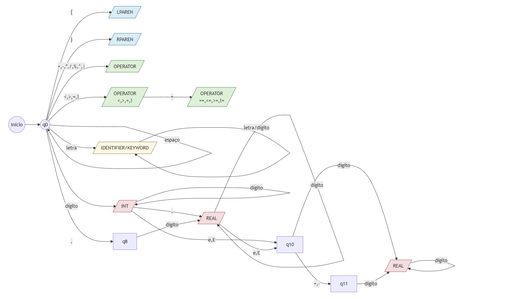
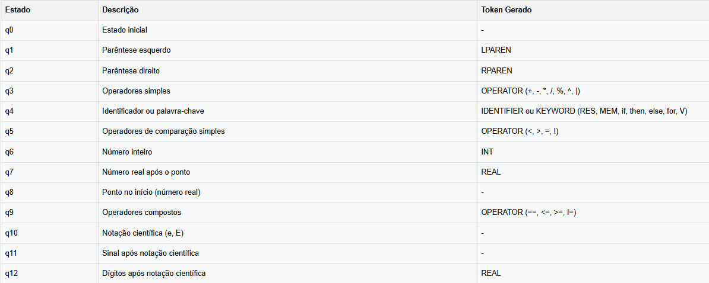

# Lexical and Syntactic Analysis

## Descrição
Este projeto implementa um analisador léxico e sintático para uma linguagem de expressões matemáticas em notação polonesa reversa (RPN). O analisador é capaz de processar expressões matemáticas complexas, incluindo operações aritméticas básicas, operações de comparação, estruturas condicionais (if-then-else) e loops (for).

## Integrantes - Grupo 04
- Gabriel Martins Vicente
- Javier Agustin Aranibar González
- Matheus Paul Lopuch
- Rafael Bonfim Zacco

### Funcionalidades
- Análise léxica utilizando Autômato Finito Determinístico (DFA)
- Suporte a números inteiros e reais
- Operadores aritméticos: +, -, *, /, %, ^, |
- Operadores de comparação: <, >, ==, !=, <=, >=
- Palavras-chave: RES, MEM, if, then, else, for, V
- Memória para armazenamento de valores
- Histórico de resultados
- Tratamento de erros com mensagens descritivas

### Funcionalidades Numéricas
- Suporte a números inteiros e reais em 16 bits
- Detecção e tratamento de overflow
- Conversão automática entre tipos numéricos
- Armazenamento eficiente na memória (MEM) e histórico (RES)

### Características Especiais
- **Precisão de 16 bits**: Todas as operações com números reais são realizadas utilizando `np.float16`, garantindo:
  - Economia de memória
  - Compatibilidade com sistemas embarcados
  - Range de valores: ±65504
  - Precisão de aproximadamente 3 dígitos decimais
  - Tratamento automático de overflow
  - Arredondamento consistente

## Como Usar
1. Execute o analisador com um arquivo de entrada:
```bash
python analisador.py arquivo_entrada.txt
```

2. O programa processará cada linha do arquivo, gerando:
   - Tokens identificados
   - Resultado da expressão
   - Mensagens de erro (se houver)

### Exemplos de Entrada
```
(1 2 +)
(5 3 -)
(2 3 *)
(10 2 /)
(5 2 %)
(2 3 ^)
(10 2 |)
(5 3 <)
(5 5 ==)
(if (5 3 <) then (1) else (0))
(for 3 (2 3 *))
(0 RES)
(5 MEM)
(V MEM)
```

### Exemplos de Saída
Para a entrada `(1 2 +)`:
```
Linha 1: (1 2 +)
  Token[0] => valor: '(', classe: LPAREN, posição: (1, 0)
  Token[1] => valor: '1', classe: INT, posição: (1, 1)
  Token[2] => valor: '2', classe: INT, posição: (1, 3)
  Token[3] => valor: '+', classe: OPERATOR, posição: (1, 5)
  Token[4] => valor: ')', classe: RPAREN, posição: (1, 6)
✅ Resultado: 3
```

#Para a entrada `(if (5 3 <) then (1) else (0))`:
```
Linha 1: (if (5 3 <) then (1) else (0))
  Token[0] => valor: '(', classe: LPAREN, posição: (1, 0)
  Token[1] => valor: 'if', classe: KEYWORD, posição: (1, 1)
  Token[2] => valor: '(', classe: LPAREN, posição: (1, 4)
  Token[3] => valor: '5', classe: INT, posição: (1, 5)
  Token[4] => valor: '3', classe: INT, posição: (1, 7)
  Token[5] => valor: '<', classe: OPERATOR, posição: (1, 9)
  Token[6] => valor: ')', classe: RPAREN, posição: (1, 10)
  Token[7] => valor: 'then', classe: KEYWORD, posição: (1, 12)
  Token[8] => valor: '(', classe: LPAREN, posição: (1, 17)
  Token[9] => valor: '1', classe: INT, posição: (1, 18)
  Token[10] => valor: ')', classe: RPAREN, posição: (1, 19)
  Token[11] => valor: 'else', classe: KEYWORD, posição: (1, 21)
  Token[12] => valor: '(', classe: LPAREN, posição: (1, 26)
  Token[13] => valor: '0', classe: INT, posição: (1, 27)
  Token[14] => valor: ')', classe: RPAREN, posição: (1, 28)
  Token[15] => valor: ')', classe: RPAREN, posição: (1, 29)
✅ Resultado: 1
```

Para a entrada com erro `(1 2 + 3)`:
```
Linha 1: (1 2 + 3)
  Token[0] => valor: '(', classe: LPAREN, posição: (1, 0)
  Token[1] => valor: '1', classe: INT, posição: (1, 1)
  Token[2] => valor: '2', classe: INT, posição: (1, 3)
  Token[3] => valor: '+', classe: OPERATOR, posição: (1, 5)
  Token[4] => valor: '3', classe: INT, posição: (1, 7)
  Token[5] => valor: ')', classe: RPAREN, posição: (1, 8)
❌ ERRO: Tokens extras após final da expressão: 3
```

## Diagrama DFA


## Legenda dos Estados


### Estados de Aceitação
Os seguintes estados são considerados de aceitação (final) e geram tokens válidos:

1. **q1**: Gera token LPAREN para parêntese esquerdo "("
2. **q2**: Gera token RPAREN para parêntese direito ")"
3. **q3**: Gera token OPERATOR para operadores simples (+, -, *, /, %, ^, |)
4. **q4**: Gera token:
   - IDENTIFIER para identificadores
   - KEYWORD para palavras reservadas (RES, MEM, if, then, else, for, V)
5. **q5**: Gera token OPERATOR para operadores de comparação simples (<, >, =, !)
6. **q6**: Gera token INT para números inteiros
7. **q7**: Gera token REAL para números reais
8. **q9**: Gera token OPERATOR para operadores de comparação compostos (==, <=, >=, !=)
9. **q12**: Gera token REAL para números em notação científica

### Estados de Não Aceitação
Os seguintes estados são intermediários e não geram tokens:

1. **q0**: Estado inicial
2. **q8**: Estado intermediário para números reais começando com ponto
3. **q10**: Estado intermediário para notação científica (e/E)
4. **q11**: Estado intermediário para sinal após notação científica

### Exemplos de Aceitação
- `(1 2 +)` → Aceito: LPAREN, INT, INT, OPERATOR, RPAREN
- `(5.2 3.1 *)` → Aceito: LPAREN, REAL, REAL, OPERATOR, RPAREN
- `(if (x < 5) then (1) else (0))` → Aceito: LPAREN, KEYWORD, LPAREN, IDENTIFIER, OPERATOR, INT, RPAREN, KEYWORD, LPAREN, INT, RPAREN, KEYWORD, LPAREN, INT, RPAREN, RPAREN

### Exemplos de Não Aceitação
- `1a2` → Não aceito: número seguido de letra
- `++` → Não aceito: operador duplicado
- `5.` → Não aceito: número real incompleto
- `1e` → Não aceito: notação científica incompleta
- `@` → Não aceito: caractere não reconhecido

## Tratamento de Erros
O analisador detecta e reporta os seguintes tipos de erros:
- Caracteres não reconhecidos
- Números mal formados
- Operadores inválidos
- Parênteses não balanceados
- Expressões mal formadas
- Divisão por zero
- Overflow em operações

### Mensagens de Erro e Correção
1. **Erros Léxicos**:
   ```
   ❌ ERRO: Unrecognized character '@' at line 1, col 0
   Correção: Utilize apenas caracteres válidos: números, operadores e parênteses
   
   ❌ ERRO: Número mal formado '1.2.3' na linha 1
   Correção: Números reais devem ter apenas um ponto decimal
   ```

2. **Erros Sintáticos**:
   ```
   ❌ ERRO: Expected '(' at beginning of expression
   Correção: Toda expressão deve começar com parêntese esquerdo
   
   ❌ ERRO: Parênteses não balanceados. ')' extra na linha 1, coluna 5
   Correção: Verifique se cada parêntese aberto tem seu correspondente fechado
   ```

3. **Erros de Operadores**:
   ```
   ❌ ERRO: Unrecognized operator '++' at line 1, col 0
   Correção: Use apenas operadores válidos: +, -, *, /, %, ^, |, <, >, ==, !=, <=, >=
   
   ❌ ERRO: Tokens extras após final da expressão: 3
   Correção: Em RPN, o operador deve vir após os operandos: (1 2 +) ao invés de (1 + 2)
   ```

4. **Erros de Execução**:
   ```
   ❌ ERRO: Divisão por zero não é permitida
   Correção: Verifique se o divisor não é zero antes da operação
   
   ❌ ERRO: Overflow ao calcular 2.0 ^ 20
   Correção: Os números devem estar dentro do range de float16 (±65504)
   ```

5. **Erros de Estruturas de Controle**:
   ```
   ❌ ERRO: Expected 'then' after condition
   Correção: A estrutura if deve seguir o formato: (if condição then expr1 else expr2)
   
   ❌ ERRO: Esperado número inteiro após 'for', encontrado '2.5'
   Correção: O contador do for deve ser um número inteiro
   ```

### Exemplos de Correção
Entrada com erro:
```
(1 + 2)  # Sintaxe incorreta para RPN
```
Mensagem:
```
❌ ERRO: Tokens extras após final da expressão: 2
```
Correção:
```
(1 2 +)  # Sintaxe correta RPN
✅ Resultado: 3
```

## Limitações Conhecidas
1. **Precisão Numérica**:
   - Números limitados a float16 (±65504)
   - Precisão de aproximadamente 3 dígitos decimais

2. **Estruturas de Controle**:
   - `for` aceita apenas números inteiros como contador
   - Não suporta loops aninhados complexos

3. **Memória**:
   - Histórico (RES) limitado ao tamanho da execução
   - Apenas uma variável de memória (MEM)
  
## Conclusão
Este projeto implementa com sucesso um analisador léxico e sintático para uma linguagem de expressões matemáticas em notação polonesa reversa (RPN). Através do uso de um Autômato Finito Determinístico (DFA), o analisador é capaz de processar e validar expressões complexas, oferecendo suporte a:

- Operações matemáticas em precisão de 16 bits
- Estruturas de controle (if-then-else e for)
- Sistema de memória e histórico de resultados
- Tratamento robusto de erros com mensagens descritivas

O projeto atende aos requisitos propostos, demonstrando a aplicação prática de conceitos fundamentais de compiladores, como análise léxica, sintática e tratamento de erros. A implementação em Python, utilizando NumPy para operações numéricas, proporciona uma solução eficiente e bem estruturada para o problema proposto.

## Referências
- Python 3.x [https://docs.python.org/3/](https://docs.python.org/3/)
- NumPy (para operações numéricas) [https://numpy.org/doc/stable/](https://numpy.org/doc/stable/)
